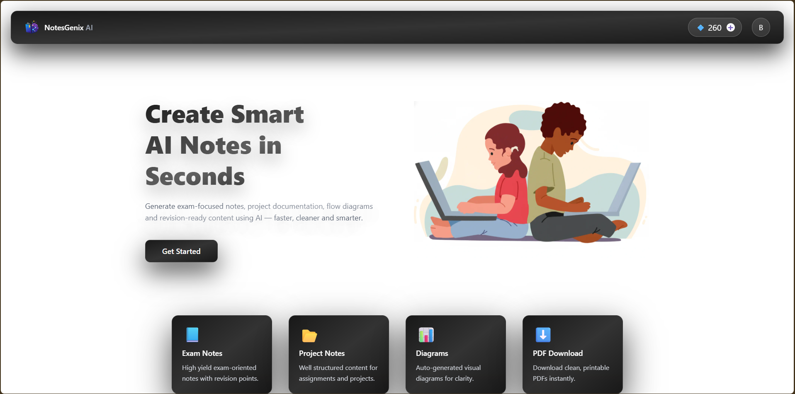
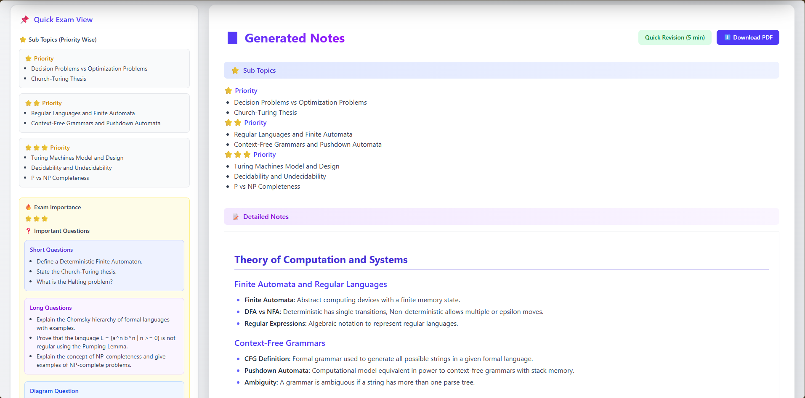
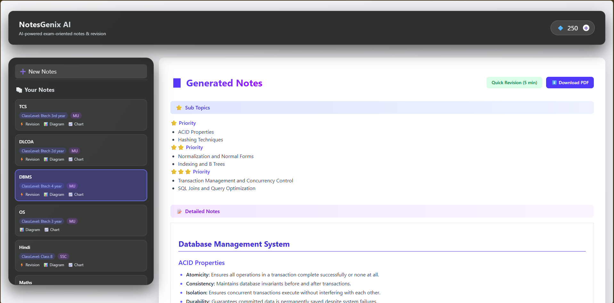
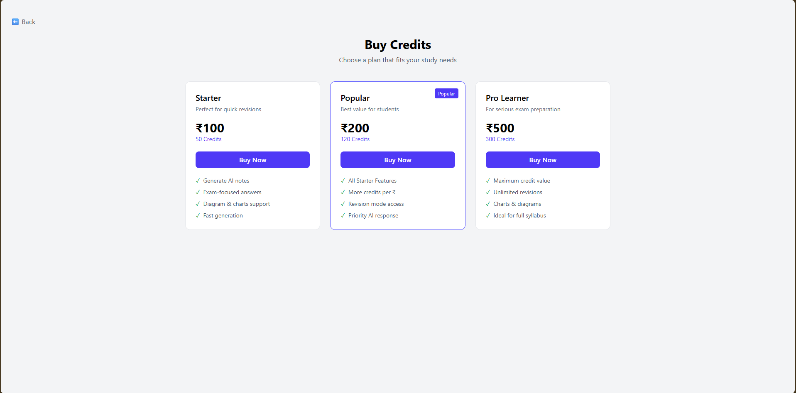

# 📚 NoteGenix – AI-Powered Exam Notes Generator

NoteGenix is a full-stack web application that helps students generate exam-focused notes using AI.

Users can enter a topic, select their class level and exam type, and generate structured notes for study and revision. The app can also generate diagrams, charts, revision points, and important questions.

🌐 **Live Demo:** https://notesgenix-aiclient.onrender.com/

---

## ✨ Features

- 🤖 Generate notes using AI
- 📝 Detailed exam-focused notes
- ⚡ Quick Revision Mode
- 📊 Generate charts and diagrams
- ❓ Important questions for practice
- 📄 Download notes as PDF
- 🕒 View previously generated notes
- 🔐 User authentication
- 🔑 Google Sign-In
- 💳 Credit-based system
- 💰 Buy credits using Stripe
- 📱 Responsive design

---

## 🛠️ Tech Stack

### Frontend

- React.js
- Redux Toolkit
- Tailwind CSS
- Axios
- Firebase Authentication
- Recharts
- Mermaid.js

### Backend

- Node.js
- Express.js
- MongoDB
- Mongoose
- JWT Authentication
- PDFKit

### APIs & Services

- Google Gemini API
- Stripe
- Firebase
- Render

---

## 🚀 How It Works

1. Create an account or sign in with Google.
2. Enter the topic you want to study.
3. Select your class level and exam type.
4. Choose options like Quick Revision, diagrams, or charts.
5. Generate notes using AI.
6. Read and revise the generated notes.
7. Download your notes as a PDF.
8. View your previously generated notes from History.

---

## 💳 Credit System

New users receive free credits to try NoteGenix.

Credits are used when generating notes. Users can purchase more credits through Stripe when required.

---

## 📸 Screenshots

### Home Page



### Generated Notes



### History



### Pricing



---

## ⚙️ Run Locally

### 1. Clone the repository

```bash
git clone https://github.com/AryanBhatare07/NotesGenix-AI.git
```

### 2. Go to the project folder

```bash
cd NoteGenix-AI-Exam-Notes-Generator
```

### 3. Install frontend dependencies

```bash
cd client
npm install
```

### 4. Install backend dependencies

```bash
cd ../server
npm install
```

### 5. Set up environment variables

Create the required `.env` files inside the frontend and backend folders.

Some of the backend environment variables are:

```env
MONGO_URI=
JWT_SECRET=
GEMINI_API_KEY=
STRIPE_SECRET_KEY=
STRIPE_WEBHOOK_SECRET=
CLIENT_URL=
```

Firebase configuration is also required for the frontend.

> ⚠️ Never upload your `.env` files or private API keys to GitHub.

### 6. Start the backend

```bash
cd server
npm start
```

### 7. Start the frontend

Open another terminal:

```bash
cd client
npm run dev
```

---

## 📂 Project Structure

```text
NoteGenix/
│
├── client/          # React frontend
├── server/          # Node.js & Express backend
├── screenshots/          
├── .gitignore
└── README.md
```

---

## 🌐 Deployment

The frontend and backend are deployed using Render.

🚀 **Try NoteGenix here:**

https://notesgenix-aiclient.onrender.com/

> The backend may take a few seconds to respond to the first request after being inactive.

---

## 👨‍💻 Author

**Aryan Bhatare**

GitHub: **@AryanBhatare07**

---

## ⭐ Support

If you found this project useful, consider giving the repository a ⭐.

It helps support the project!